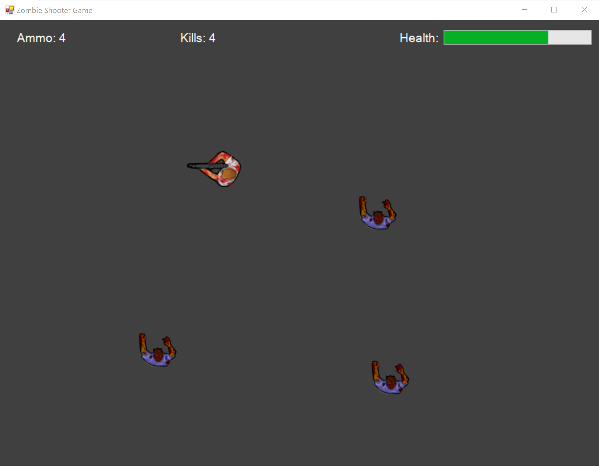
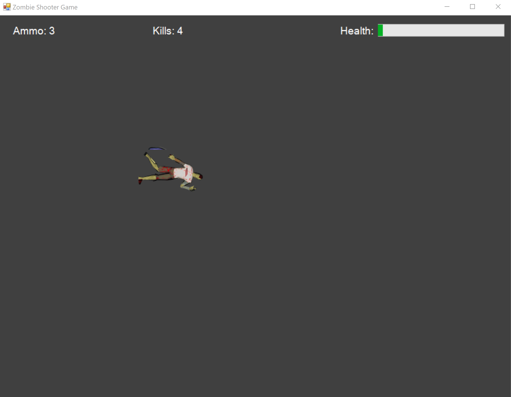
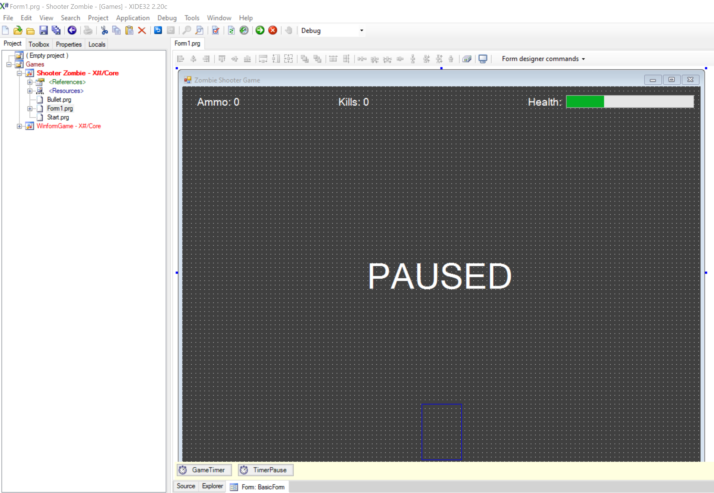

# Zombie Shooter: An X# Game

This repository showcases a basic 2D zombie shooter game implemented in X#. It serves as a practical example of using X# for game development.

## Core features:

**Game loop:** Manages game logic and updates the game state at regular intervals.
**Player control:** Implements player movement and shooting mechanics using keyboard input.
**Enemy AI:** Simulates basic zombie behavior, including movement and collision detection.
**Collision detection:** Determines interactions between the player, zombies, and bullets.
**Game objects:** Utilizes PictureBox controls to represent game entities like the player, zombies, and bullets.
**Resource management:** Loads game assets (images) using the ResourceManager class.
This project provides a foundation for exploring more advanced game development concepts in X#, such as object-oriented programming, graphics, sound, and user interface design.

## Screenshots

## Credits
- [Make a Top Down Zombie Shooter Game in Windows Form and C#](https://youtu.be/TxmhaSTRav4?si=XR_pYvrttxylmEQG)
